## Документация Helios

> **Умное управление свето-звуковыми лампами**  
> Сервис управления свето-звуковыми лампами в рамках проекта. Предоставлен HTTP метод для изменения базового цвета устройства, обеспечено прослушивание очереди RabbitMQ и создание внутренних событий на основе входящих сообщений, а также реализовано управление цветом лампы с учетом  внутренних событий
---


## 🧱 Архитектура системы

Zabbix - отравляет HTTP запрос на изменение базового цвета, если произошел сбой в устройстве контролируемом Zabbix

Интеллект присылает события в RabbitMQ в очередь и отслеживает инциденты

## 🔧 Основные компоненты

| Компонент       | Технология       | Назначение |
|----------------|------------------|-----------|
| **API**         | FastAPI          | Обработка HTTP-запросов, управление LED и устройствами |
| **ORM**         | SQLAlchemy (Async) | Работа с PostgreSQL, модели данных |
| **Очереди**     | RabbitMQ         | Приём событий от Zabbix и других систем |
| **MQTT**        | Eclipse Paho / AsyncIO | Отправка команд на LED в реальном времени |
| **База данных** | PostgreSQL       | Хранение LED, устройств, активных событий |
| **Фоновые задачи** | asyncio       | Автоматическое обновление цвета, очистка, аварийный режим |

---

## 🗃️ Модели данных

### 1. `LED` — Центральное устройство

> 🔦 Физическое LED-устройство, управляющее цветом через Modbus и MQTT.

```python
class LED(Base):
    zabbix_id: str
    color_base: str
    color_active: str
    reg_red: str
    reg_green: str
    reg_yellow: str
    modbus_port: str
    mqtt_port: str
    host: str
```
## 📌 Основные параметры

| Поле          | Тип данных | Описание                                                   |
|---------------|------------|------------------------------------------------------------|
| `zabbix_id`   | String(30) | Уникальный идентификатор в системе мониторинга Zabbix      |
| `color_base`  | String(30) | Базовый цвет устройства в формате Enum(red, yellow, green) |
| `color_active`| String(30) | Текущий активный цвет с учетом всех событий                |

## 🎨 Управление цветом (Modbus)

| Поле         | Тип данных | Описание                                  |
|--------------|------------|-------------------------------------------|
| `reg_red`    | String(30) | Адрес регистра управления красным цветом  |
| `reg_green`  | String(30) | Адрес регистра управления зеленым цветом  |
| `reg_yellow` | String(30) | Адрес регистра управления желтым цветом   |

## 🔧 Параметры подключения

| Поле            | Тип данных | Описание                                  |
|-----------------|------------|-------------------------------------------|
| `host`         | String(255)| IP-адрес или доменное имя устройства      |
| `modbus_port`  | String(10) | Порт для подключения по протоколу Modbus  |
| `mqtt_port`    | String(10) | Порт для подключения по протоколу MQTT    |

## Пример конфигурации
```json
{
  "zabbix_id": "LAMP-42",
  "color_base": "",
  "color_active": "",
  "host": "192.168.1.100",
  "modbus_port": "502",
  "reg_red": "",
  "reg_green": ""
}
```

### 2. Модель `Device` (Подключенное устройство)

## 📌 Основные характеристики

| Поле         | Тип данных    | Описание                                  | Пример значения        |
|--------------|---------------|-------------------------------------------|------------------------|
| `iidk_id`    | String(30)    | Уникальный идентификатор устройства       | "BTN-EMERGENCY-01"     |
| `led_id`     | Integer (FK)  | Связь с родительским LED-устройством      | 42                     |
| `name`       | String(30)    | Человеко-читаемое название устройства     | "Кнопка аварийного останова" |
| `device_type`| String(30)    | Тип физического устройства                | "button", "sensor"      |

## 🔧 Типы устройств

```python
Доступные типы:
- "button"    # Кнопки и выключатели
- "sensor"    # Датчики движения/присутствия  
- "gateway"   # Шлюзы и контроллеры
- "reader"    # Считыватели карт
- "terminal"  # Панели управления
```

## Пример конфигурации
```json
{
  "iidk_id": "SENSOR-ENTRANCE-02",
  "led_id": 15,
  "name": "Датчик входа в серверную",
  "device_type": "sensor"
}
```

## 3.️ Модель Event (Временное событие)

### 🕒 Основные параметры

| Поле          | Тип данных    | Описание                                  | Пример значения        |
|---------------|---------------|-------------------------------------------|------------------------|
| `led_id`      | Integer (FK)  | Связь с LED-устройством                   | 24                     |
| `protocol_id` | String(100)   | Идентификатор события во внешней системе  | "ZABBIX-ALERT-12345"   |
| `color`       | String(30)    | Цвет события (HEX-формат)                 | "#FFA500" (оранжевый)  |
| `expired_at`  | DateTime      | Время окончания действия события          | 2023-12-31 23:59:59    |
| `created_at`  | DateTime      | Автоматическая метка времени создания     | 2023-11-20 14:30:00    |

 
### Пример конфигурации

```json
{
  "led_id": 5,
  "protocol_id": "ZBX-ALERT-67890",
  "color": "#FF0000",
  "expired_at": "2023-11-21T09:00:00"
}
```

## 🛠️ Установка

### Клонирование и настройка окружения

```bash
# 1. Создаем виртуальное окружение
python -m venv venv

# 2. Активируем окружение
# Для Windows:
.\venv\Scripts\activate
# Для Linux/MacOS:
source venv/bin/activate

# 3. Устанавливаем зависимости
pip install -r requirements.txt

# 4. Создаем .env файл и вставляем туда константы из .env.exemple(заполняем необходимые данные)
mkdir .env
```

## Выпуск самоподписанных сертификатов

```bash
# 1. создаём папку ssl
mkdir ssl
# 2. проваливаемся внутрь
cd sll
# 3. генерируем сертификаты
 openssl req -x509 -newkey rsa:2048 -days <number of days> -nodes -keyout server.key -out server.crt -subj "/C=RU/ST=Moscow/L=Moscow/O=Example/CN=*.example.com" -addext "subjectAltName = DNS:*.example.com, IP:<IP-address>"
```

## Сборка в бинарник

```bash
 pyinstaller --onefile --name myapp --add-data=".env;." --add-data="ssl/server.crt;ssl" --add-data="ssl/server.key;ssl" --hidden-import main.py
# [ssl.crt](ssl.crt), [ssl.key](ssl.key), [app_db](app_db), [.env](dist/main_app/.env) кладём в папку dist/main_app
```

## Заходим в папку [dist](dist)/[main_app](dist/main_app) запускаем main_app.exe


# 📘 Инструкция по работе с интерфейсом Helios

## 1. Управление точками прохода
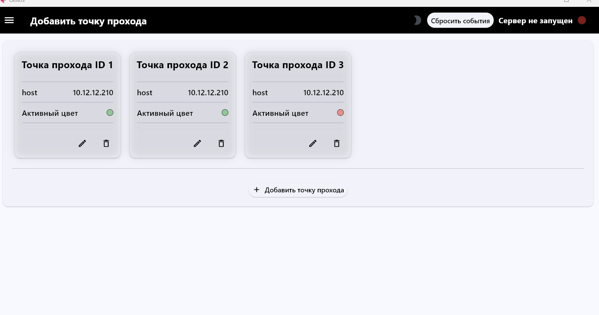
### Добавление новой точки прохода
1. Нажмите кнопку

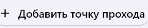
2. Заполните форму: 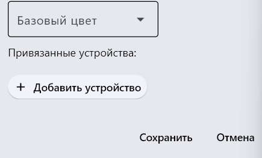
   ```plaintext
   Обязательные поля:
   - host: IP-адрес устройства (например, 10.12.12.210)
   - Zabbix ID: Идентификатор в системе мониторинга
   - modbus_port: Порт Modbus (обычно 502)
   - mqtt_port: Порт MQTT-брокера

   Параметры цвета:
   - reg_red: Адрес регистра красного цвета
   - reg_green: Адрес регистра зеленого цвета  
   - reg_yellow: Адрес регистра желтого цвета
   - Активный цвет: Текущий цвет (HEX-формат)
   ```
   Задайте цветовые параметры:

   - Активный цвет: Текущий рабочий режим
   - Базовый цвет: Цвет по умолчанию (при отсутствии событий)
   
3. При желании можете добавить устройство нажав на кнопку `+ Добавить устройство`

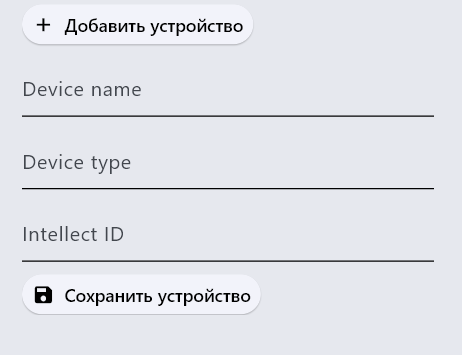


```plaintext
Обязательные поля:
- Device name: Уникальное имя устройства (например, "Турникет главный вход")
- Device type: Выберите из списка:
  • reader - считыватель
  • turnstile - турникет  
  • sensor - датчик
  • gateway - шлюз
  • button - кнопка
- Intellect ID: Внутренний идентификатор в системе (например, "DEV-ENTRANCE-01")
```

Нажмите `+ Сохранить устройство` что его сохранить 

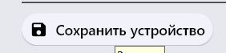

и нажмите `+ Сохранить` чтобы сохранить точку прохода


### Редактирование существующей точки
1. Найдите нужную точку в списке (например, `Точка прохода ID 1`)

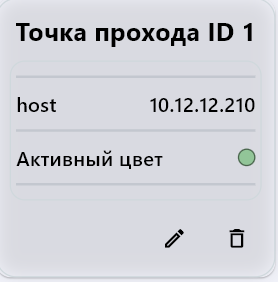
2. Нажмите на карандаш чтобы войти в редактирование

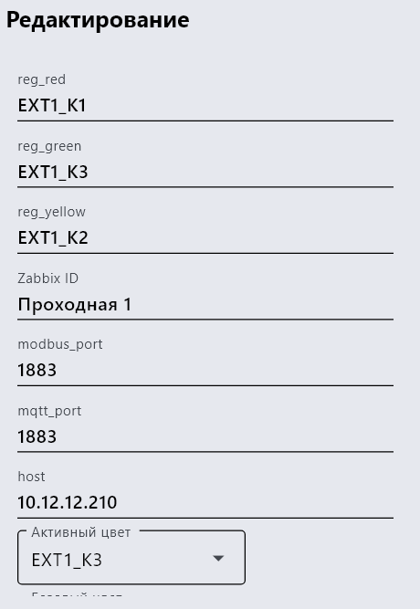

3. Проведите необходимые изменения
4. Сохраните изменения


> 💡 Все точки прохода отображают текущий активный цвет, который может меняться в зависимости от событий системы.

## 2. Настройка сервера

### Конфигурация подключения
1. Перейдите в раздел `Конфигурация сервера`

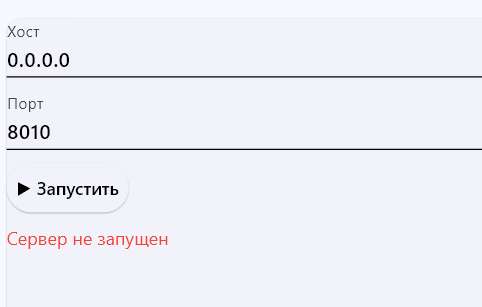Ф
2. Заполните параметры:
   - **Хост**: IP-адрес сервера (0.0.0.0 для всех интерфейсов)
   - **Порт**: Порт для подключения (по умолчанию 8010)

### Запуск сервера
1. Проверьте правильность введенных параметров
2. Нажмите кнопку `Запустить`

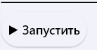
3. Статус изменится на `Сервер запущен на "хост который в указали"` при успешном старте

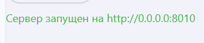

## 3. Работа с логами

### Просмотр логов
1. Откройте раздел `Логи сервера`


2. Система автоматически отображает последние события

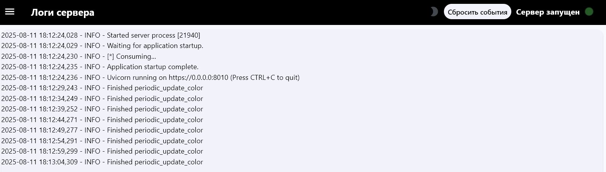

### Управление логами
- `Очистить логи` - полностью удаляет историю логов

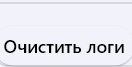
- `Сбросить события` - очищает текущие активные события (доступно только при остановленном сервере)


## 4. Важные заметки

1. При изменении конфигурации требуется перезапуск сервера
2. IP-адреса точек прохода должны быть доступны из сети
3. Цвета отображаются в формате 
4. Статус сервера обновляется в реальном времени
5. Вы можете поменять тему приложения на тёмную нажав на луну
 
